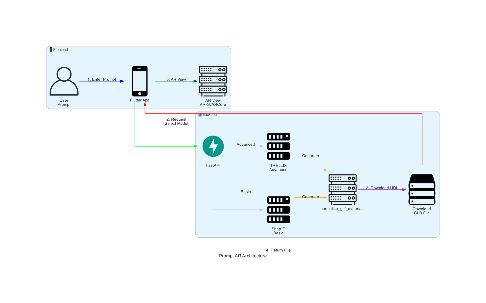

# Prompt AR

<div align="center">
  
  
  **Generate 3D objects from text prompts and visualize them in Augmented Reality**
  
  
  
  [](https://flutter.dev/)
  [](https://www.python.org/)
  [](https://fastapi.tiangolo.com/)
  [](LICENSE)
</div>

---

## 🎯 Overview

**Prompt AR** is an innovative mobile application that combines the power of AI-driven 3D model generation with immersive Augmented Reality visualization. Simply describe what you want to see in natural language, and watch as the app generates a 3D model that you can place, interact with, and explore in your real-world environment through your phone's camera.

### Key Highlights

- 🤖 **AI-Powered Generation**: Leverages cutting-edge text-to-3D models (Shap-E and TRELLIS)
- 📱 **AR Visualization**: Real-time Augmented Reality placement and interaction
- 🎨 **Two Quality Modes**: Choose between fast basic generation or high-quality advanced models
- 🌐 **Cross-Platform**: Native iOS and Android support
- ⚡ **Real-Time**: Generate and visualize 3D models in seconds

## ✨ Features

- 🎨 **Text-to-3D Generation**: Convert text descriptions into 3D models using state-of-the-art AI models
- 📱 **AR Visualization**: View and interact with generated models in Augmented Reality
- 🚀 **Dual Generation Modes**:
  - **Basic Mode**: Uses Shap-E model for faster, simpler 3D model generation (5-10 seconds)
  - **Advanced Mode**: Uses TRELLIS model for higher quality 3D models with textures (10-30 seconds)
- 📦 **GLB Format**: Models are generated in GLB format, optimized for AR applications
- 🎯 **Plane Detection**: Automatically detects horizontal and vertical surfaces for model placement
- 🖱️ **Interactive Controls**: Pan, rotate, and scale models in AR space
- 💾 **Model Management**: Save and reuse generated models
- 🌐 **Cross-platform**: Works seamlessly on both iOS and Android devices

## 🏗️ Architecture

Prompt AR consists of two main components:

- **Frontend (Flutter)**: Cross-platform mobile app for AR visualization
- **Backend (FastAPI)**: REST API for 3D model generation

### System Flow

<div align="center">
  
</div>

**Flow Overview:**
1. User enters text prompt in Flutter app
2. App sends request to Backend with model type selection (Basic/Advanced)
3. Backend generates 3D model using Shap-E (Basic) or TRELLIS (Advanced)
4. Backend applies `normalize_gltf_materials` for AR optimization
5. Backend returns download URL
6. Frontend downloads and displays model in AR view

See [Frontend README](frontend_prompt_ar/README.md) and [Backend README](backend/README.md) for detailed architecture and setup instructions.

## 🚀 Quick Start

### Prerequisites

- **Backend**: Python 3.11+, Hugging Face account (free) - *or use the hosted backend*
- **Frontend**: Flutter SDK 3.5.3+, iOS 12+ or Android API 21+
- **Device**: iOS or Android device with AR support (ARCore/ARKit)

### Using the Hosted Backend (Recommended)

The backend is already hosted on Hugging Face Spaces and ready to use:
- **Live API**: [https://xnikkon-prmpt-ar-be.hf.space](https://xnikkon-prmpt-ar-be.hf.space)
- **API Docs**: [https://xnikkon-prmpt-ar-be.hf.space/docs](https://xnikkon-prmpt-ar-be.hf.space/docs)

No backend setup required! Just configure the frontend to use the hosted API.

### Setup Instructions

- **Frontend Setup**: See [Frontend README](frontend_prompt_ar/README.md) for detailed Flutter setup instructions
- **Backend Setup**: See [Backend README](backend/README.md) if you want to run your own backend instance

## 📡 API

The backend API is hosted on Hugging Face Spaces:
- **Live API**: [https://xnikkon-prmpt-ar-be.hf.space](https://xnikkon-prmpt-ar-be.hf.space)
- **API Documentation**: [https://xnikkon-prmpt-ar-be.hf.space/docs](https://xnikkon-prmpt-ar-be.hf.space/docs)

For detailed API endpoints and usage, see [Backend README](backend/README.md).

## 📁 Project Structure

```
prompt_ar/
├── backend/              # Python FastAPI backend
│   └── README.md        # Backend documentation
└── frontend_prompt_ar/  # Flutter frontend
    └── README.md        # Frontend documentation
```

For detailed project structure and requirements, see:
- [Frontend README](frontend_prompt_ar/README.md) - Flutter app structure and platform support
- [Backend README](backend/README.md) - Backend architecture and API details

## 🎯 Use Cases

- **Education**: Visualize 3D concepts in AR for learning
- **Design**: Quick prototyping and visualization of design ideas
- **Entertainment**: Create and interact with 3D objects in your environment
- **E-commerce**: Preview products in AR before purchase
- **Architecture**: Visualize architectural concepts in real spaces

## 🤝 Contributing

Contributions are welcome! Please feel free to submit a Pull Request. For major changes, please open an issue first to discuss what you would like to change.

## 📄 License

This project is licensed under the CC0-1.0 License - See [LICENSE](LICENSE) file for details.


## 🙏 Acknowledgments

- [TRELLIS](https://huggingface.co/spaces/dkatz2391/TRELLIS_TextTo3D_Try2) - Advanced 3D model generation by Microsoft
- [Shap-E](https://github.com/openai/shap-e) - Basic 3D model generation by OpenAI
- [Hugging Face](https://huggingface.co/) - Model hosting and inference platform, and Spaces hosting
- [AR Flutter Plugin](https://github.com/nikkon404/ar_flutter_plugin_2) - AR visualization framework

## 📞 Support

For issues, questions, or contributions, please open an issue on the GitHub repository.

---

<div align="center">
  Made with ❤️ using Flutter and FastAPI
</div>
